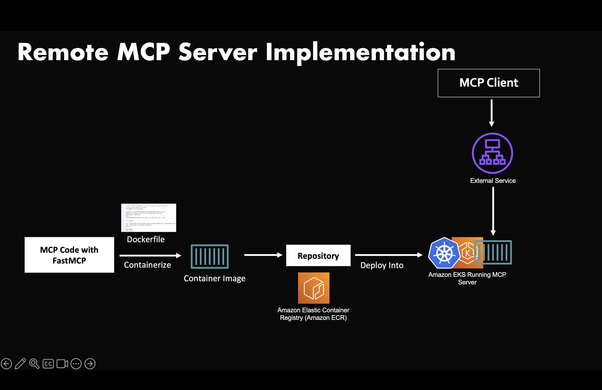

# Remote MCP Server on Kubernetes (Amazon EKS)

A containerized MCP (Model Context Protocol) server using FastMCP that provides a simple calculator tool for adding two numbers. This MCP server runs on Amazon EKS. The highlevel diagram of this project below:


[Detailed walkthrough video](https://youtu.be/jv67szyjKfc)

## Files

- `server.py` - FastMCP server with add_numbers tool
- `requirements.txt` - Python dependencies
- `Dockerfile` - Container definition
- `k8s-deployment.yaml` - Kubernetes deployment and LoadBalancer service
- `test_mcp_client.py` - Test Remote MCP Server

## Building the Container

```bash
docker build -t mcp-calculator:latest .
```

## Running Locally

```bash
# Run the container locally
docker run -p 8000:8000 mcp-calculator:latest
```

The server will be available at `http://localhost:8000`

## Push to repo

You can push this image to either Dockerhub or an ECR repo

## Deploying to Amazon EKS

### Prerequisites
- AWS CLI configured with appropriate permissions
- kubectl installed
- Docker installed and running

### EKS Cluster 
You can use an existing EKS cluster or create a new one, it's upto you. Ensure that your terminal has access to run Kubectl on it

### Deployment Steps

IMPORTANT: Change the container image to the repo URI in k8s-deployment.yaml file

1. **Deploy MCP Server container to EKS**:
```bash
# Deploy the application
kubectl apply -f k8s-deployment.yaml

# Check deployment status
kubectl rollout status deployment/mcp-calculator

# Get service information
kubectl get services mcp-calculator-service
```

2. **Get the LoadBalancer external IP**:
```bash
kubectl get services mcp-calculator-service -w
```


## Testing the MCP Server

The server provides one tool:
- `add_numbers(a: float, b: float) -> float` - Adds two numbers together

### Testing with curl

The MCP server is currently deployed and accessible at:
```
http://<insert loadbalancer url>/mcp/
```

#### Complete curl Test Workflow

**Step 1: Initialize MCP Session and Get Session ID**
```bash
SESSION_ID=$(curl -s -X POST \
  -H "Content-Type: application/json" \
  -H "Accept: application/json, text/event-stream" \
  -d '{"jsonrpc":"2.0","id":1,"method":"initialize","params":{"protocolVersion":"2024-11-05","capabilities":{"roots":{"listChanged":true},"sampling":{}},"clientInfo":{"name":"curl-test","version":"1.0.0"}}}' \
  http://<insert loadbalancer url>/mcp/ \
  -D /dev/stderr 2>&1 | grep "mcp-session-id:" | cut -d' ' -f2 | tr -d '\r')

echo "Session ID: $SESSION_ID"
```

**Step 2: Send Initialization Notification (Required by MCP Protocol)**
```bash
curl -s -X POST \
  -H "Content-Type: application/json" \
  -H "Accept: application/json, text/event-stream" \
  -H "mcp-session-id: $SESSION_ID" \
  -d '{"jsonrpc":"2.0","method":"notifications/initialized"}' \
  http://<insert loadbalancer url>/mcp/
```

**Step 3: List Available Tools (Optional)**
```bash
curl -X POST \
  -H "Content-Type: application/json" \
  -H "Accept: application/json, text/event-stream" \
  -H "mcp-session-id: $SESSION_ID" \
  -d '{"jsonrpc":"2.0","id":2,"method":"tools/list"}' \
  http://<insert loadbalancer url>/mcp/
```

**Expected Result:**
```
event: message
data: {"jsonrpc":"2.0","id":2,"result":{"tools":[{"name":"add_numbers","description":"Add two numbers together.\n\nArgs:\n    a: First number to add\n    b: Second number to add\n    \nReturns:\n    The sum of a and b","inputSchema":{"type":"object","properties":{"a":{"type":"number"},"b":{"type":"number"}},"required":["a","b"]}}]}}
```

**Step 4: Call the add_numbers Tool**
```bash
curl -X POST \
  -H "Content-Type: application/json" \
  -H "Accept: application/json, text/event-stream" \
  -H "mcp-session-id: $SESSION_ID" \
  -d '{"jsonrpc":"2.0","id":3,"method":"tools/call","params":{"name":"add_numbers","arguments":{"a":15.5,"b":24.3}}}' \
  http://<insert loadbalancer url>/mcp/
```

**Expected Result:**
```
event: message
data: {"jsonrpc":"2.0","id":3,"result":{"content":[{"type":"text","text":"39.8"}],"structuredContent":{"result":39.8},"isError":false}}
```
### Testing with Python client

Replace the URL in the test_mcp_client.py, and execute it. This will act as MCP client and test the MCP server

#### Important Notes
- **Session Timeout**: Sessions expire after ~30-60 seconds due to FastMCP framework limitations
- **Rapid Execution**: Execute all steps quickly or use the one-liner command
- **MCP Protocol**: The `notifications/initialized` step is required by the MCP protocol after initialization


## Cleanup

To remove from Kubernetes:
```bash
kubectl delete -f k8s-deployment.yaml
